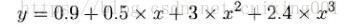
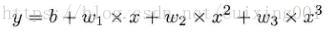
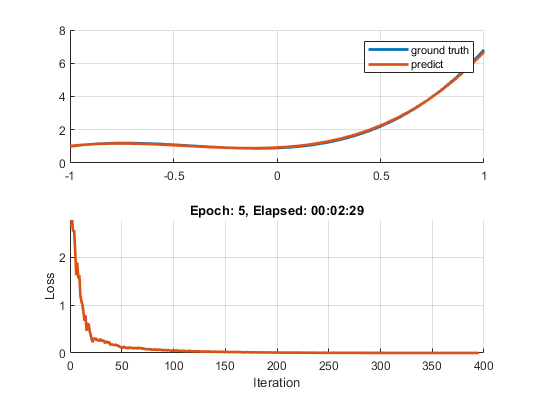

# 用深度学习拟合多项式系数

实现来自[https://blog.csdn.net/cuixing001/article/details/82317630](https://blog.csdn.net/cuixing001/article/details/82317630)示例。

首先给出真值多项式参考方程：



其对应参数形式为：



程序实现思路为 ：根据方程1，给定一些样本数据点坐标（x，y）点集，及最小均方差为目标，求解最佳参数（w1,w2,w3,b）。

下图为动态显示在深度学习训练过程中多项式逐渐逼近真值曲线！


## 使用简单的自定义操作符

```matlab
% fit polynormal
xsample = linspace(-1,1,30);
w = [0.5,3,2.4];
b = 0.9;
ysample = b+w(1).*xsample+w(2).*xsample.^2+w(3).*xsample.^3;

% input network data
x = 2*rand(10000,1)-1; % [-1,1] range
Xdata = dlarray(x,"SC");
Ydata = b + w(1).*x + w(2).*x.^2 + w(3).*x.^3;
Ydata = dlarray(Ydata, "SC");

% 可训练参数
params.x1 = dlarray(rand());
params.x2 = dlarray(rand());
params.x3 = dlarray(rand());
params.b = dlarray(rand());

% Initialize the training progress plot.
figure;
tiledlayout(2,1)
nexttile;
hold on;grid on;
gtLine = plot(xsample,ysample,LineWidth=2,DisplayName="ground truth");
predictLine = plot(xsample,nan(1,length(xsample)),LineWidth=2,DisplayName="predict");
legend

nexttile;
lineLossTrain = animatedline(LineWidth=2);
ylim([0 inf])
xlabel("Iteration")
ylabel("Loss")
grid on

% 初始化超参数
learningRate = 1e-2;
miniBatchSize = 128;
numEpochs = 5;
numObservations = numel(Ydata);
numIterationsPerEpoch = floor(numObservations./miniBatchSize);

% 初始化adam参数
avgGrad = [];
avgSqGrad = [];
velocity = [];

% Loop over epochs.
start = tic;
for epoch = 1:numEpochs
    % Shuffle data.
    idx = randperm(numel(Ydata));
    Xdata = Xdata(idx,:);
    Ydata = Ydata(idx,:);

    for iter = 1:numIterationsPerEpoch


        % Read mini-batch of data and convert the labels to dummy
        % variables.
        idx = (iter-1)*miniBatchSize+1:iter*miniBatchSize;
        Xbatch = Xdata(idx,:);
        Ybatch = Ydata(idx,:);

        % If training on a GPU, then convert data to a gpuArray.
        if canUseGPU
            Xbatch = gpuArray(Xbatch);
        end

        % 自动微分
        [loss, gradients] = dlfeval(@modelLoss, params,Xbatch,Ybatch);

        % 使用 Adam 更新每个参数
        [params, avgGrad, avgSqGrad] = adamupdate(params, gradients, ...
            avgGrad, avgSqGrad, iter, learningRate);

        % Update the network parameters using the SGDM optimizer.
        % [params,velocity] = sgdmupdate(params,gradients,velocity);

        % plot fit line
        w1 = extractdata(params.x1);
        w2 = extractdata(params.x2);
        w3 = extractdata(params.x3);
        b = extractdata(params.b);
        predictPt = b+w1.*xsample+w2.*xsample.^2+w3.*xsample.^3;
        predictLine.YData = gather(predictPt);

        % Display the training progress.
        D = duration(0,0,toc(start),Format="hh:mm:ss");
        loss = double(loss);
        addpoints(lineLossTrain,(epoch-1)*numIterationsPerEpoch+iter,loss)
        title("Epoch: " + epoch + ", Elapsed: " + string(D))

        drawnow
    end
end

function [loss,gradients] = modelLoss(params,Xdata,Ydata)
w1 = params.x1;
w2 = params.x2;
w3 = params.x3;
b = params.b;

output = b+w1.*Xdata+w2.*Xdata.^2+w3.*Xdata.^3;
loss = l2loss(output,Ydata);
gradients = dlgradient(loss, params);
end
```

----

## 使用内建的layer


### step1:  Data preprocess

```matlab
xsample = linspace(-1,1,30);
w = [0.5,3,2.4];
b = 0.9;
ysample = b+w(1).*xsample+w(2).*xsample.^2+w(3).*xsample.^3;

% input network data
x = 2*rand(10000,1)-1; % [-1,1] range
Xdata = [x,x.^2,x.^3];
Ydata = b+w(1).*x+w(2).*x.^2+w(3).*x.^3;
```

### step2: define model and train

```matlab
numFeatures = 3;
layers = [featureInputLayer(numFeatures,'Name','input')
    fullyConnectedLayer(1, 'Name','fc')];
net = dlnetwork(layers);

arrdsX = arrayDatastore(Xdata);
arrdsY = arrayDatastore(Ydata);
arrds = combine(arrdsX,arrdsY);
mbq = minibatchqueue(arrds,2,MiniBatchFormat={'BC','BC'});

% Initialize the training progress plot.
figure;
tiledlayout(2,1)
nexttile;
hold on;grid on;
gtLine = plot(xsample,ysample,LineWidth=2,DisplayName="ground truth");
predictLine = plot(xsample,nan(1,length(xsample)),LineWidth=2,DisplayName="predict");
legend

nexttile;
C = colororder;
lineLossTrain = animatedline(Color=C(2,:),LineWidth=2);
ylim([0 inf])
xlabel("Iteration")
ylabel("Loss")
grid on

%
iteration = 0;
numEpochs = 5;
velocity = [];
start = tic;

% Loop over epochs.
for epoch = 1:numEpochs

    % Shuffle data.
    shuffle(mbq);
    
    % Loop over mini-batches.
    while hasdata(mbq)
        iteration = iteration + 1;
        
        % Read mini-batch of data.
        [X,T] = next(mbq);
        
        % Evaluate the model gradients, state, and loss using dlfeval and the
        % modelLoss function and update the network state.
        [loss,gradients,state] = dlfeval(@modelLoss,net,X,T);
        net.State = state;
        
        % Update the network parameters using the SGDM optimizer.
        [net,velocity] = sgdmupdate(net,gradients,velocity);

        % plot fit line
        ww = extractdata(net.Learnables.Value{1});
        bb= extractdata(net.Learnables.Value{2});
        predictPt = bb+ww(1).*xsample+ww(2).*xsample.^2+ww(3).*xsample.^3;
        predictLine.YData = predictPt;
        
        % Display the training progress.
        D = duration(0,0,toc(start),Format="hh:mm:ss");
        loss = double(loss);
        addpoints(lineLossTrain,iteration,loss)
        title("Epoch: " + epoch + ", Elapsed: " + string(D))

       exportgraphics(gcf,"polyfit.gif","Append",true)
        drawnow
    end
end
```



```matlab:Code

```

```matlab
function [f,g,state] = modelLoss(net,X,T)
% Calculate objective using supported functions for dlarray
    [Y,state] = forward(net,X);
    f = mse(Y,T);%sum((Y-T).^2);
    g = dlgradient(f,net.Learnables); % Automatic gradient
end
```
------


